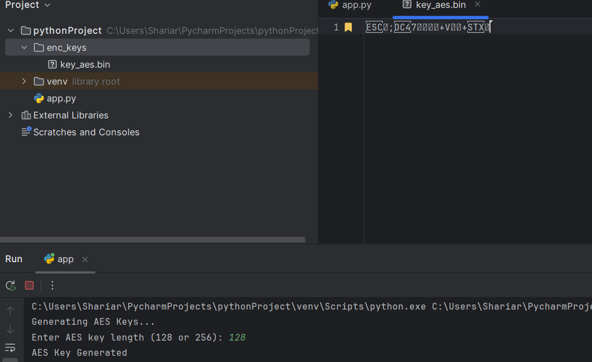
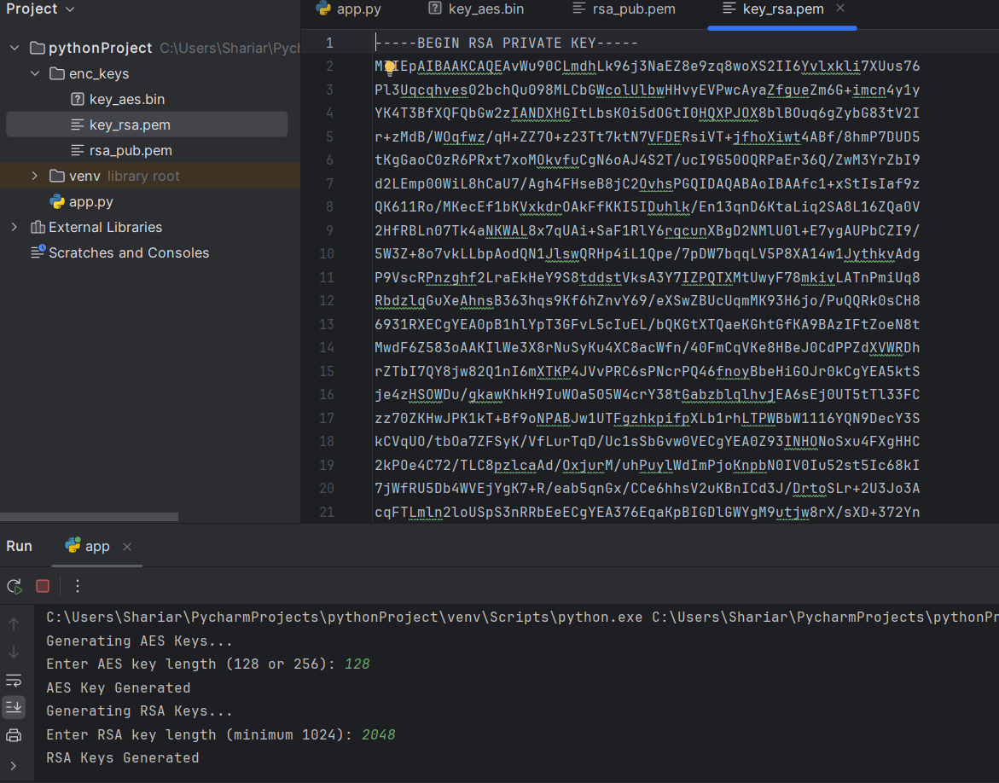
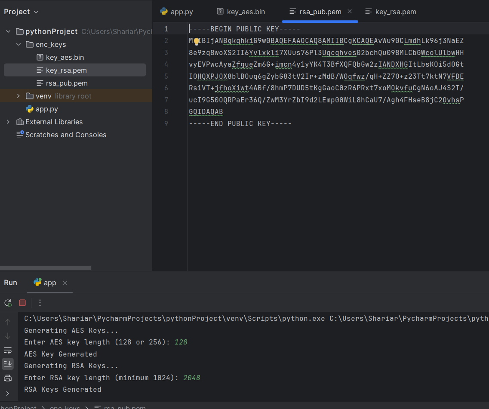

# Lab 4 Report


## Prerequisites

open terminal and install pycryptodome

```sh
pip install pycryptodome
```
### Generating AES Key
For encryption and decryption, we need to generate an AES key. Create Either 128 or 256, user has the right to choose 128 or 256 size on console. 

```sh
def aes_key_generate(bits):
   key = get_random_bytes((bits + 7) // 8)
   with open(os.path.join(DIR_KEYS, AES_KEY_FILE), 'wb') as f:
       f.write(key)
   return key
```



###

### Generating RSA Key. Minimum length is 1024. 

```sh
def rsa_key_generate(bits):
   key = RSA.generate(bits)
   key_private = key.export_key()
   key_public = key.publickey().export_key()
   with open(os.path.join(DIR_KEYS, RSA_KEY_FILE), 'wb') as f:
       f.write(key_private)
   with open(os.path.join(DIR_KEYS, RSA_PUBLIC_KEY_FILE), 'wb') as f:
       f.write(key_public)
   return key_private, key_public
   ```

   





###

### AES Encryption and Decryption On Both ECB or CBC Mode

   ```sh
   def aes_encrypt(data, key, mode):
   cipher = AES.new(key, AES_MODE[mode])
   if mode == 'ECB':
       ciphertext = cipher.encrypt(pad(data, AES.block_size))
   else:
       iv = get_random_bytes(AES.block_size)
       cipher = AES.new(key, AES_MODE[mode], iv)
       ciphertext = iv + cipher.encrypt(data)
   return ciphertext


def aes_decrypt(ciphertext, key, mode):
   cipher = AES.new(key, AES_MODE[mode])
   if mode == 'ECB':
       plaintext = unpad(cipher.decrypt(ciphertext), AES.block_size)
   else:
       iv = ciphertext[:AES.block_size]
       cipher = AES.new(key, AES_MODE[mode], iv)
       plaintext = cipher.decrypt(ciphertext[AES.block_size:])
   return plaintext

   ```

### RSA Encryption and Decryption

```sh

def rsa_encrypt(data, public_key):
   cipher = PKCS1_OAEP.new(public_key)
   return cipher.encrypt(data)


def rsa_decrypt(ciphertext, private_key):
   cipher = PKCS1_OAEP.new(private_key)
   return cipher.decrypt(ciphertext)
```
### RSA Signature

```sh
def rsa_sign(data, private_key):
   h = SHA256.new(data)
   signature = pkcs1_15.new(private_key).sign(h)
   return signature
```
### RSA Signature Verify
```sh

def rsa_verify(data, signature, public_key):
   h = SHA256.new(data)
   try:
       pkcs1_15.new(public_key).verify(h, signature)
       return True
   except (ValueError, TypeError):
       return False
```

### SHA-256 hashing
```sh
def sha256_hash(data):
   return hashlib.sha256(data).hexdigest()
```


