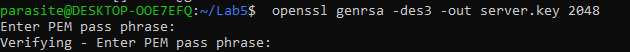

# Lab 5 Report

## Overview
This lab involves setting up and configuring Apache servers to host websites on `localhost` using both HTTP and HTTPS protocols. The steps are divided into four checkpoints.

## Checkpoint 1: Access https://localhost:4433 and Describe Observations
### Steps Followed:
1. Created an Apache server.
2. By default, it was hosted on `localhost` (127.0.0.1) using the HTTP protocol (`http://`), which is not secure.
3. Added `example.com` to `/var/www/example.com/html/index.html`.
4. Hosted the `index.html` file in `example.com`.
5. Configured the server to use HTTP protocol on port 80, hosting the site at `http://example.com`, which is not secure.

### Observations:
- The site was accessible via HTTP but was not secure.

## Checkpoint 2: Repeat the Setup for `webserverlab.com` and Show the Results
### Steps Followed:
1. Served the `/var/www/html/index.html`.
2. Configured `default-ssl.conf` and added `webserverlab.com` to the `localhost`.
3. Both `webserverlab.com` and `example.com` were hosted using HTTP.

### Observations:
- Both sites were accessible via HTTP but were not secure.

## Checkpoint 3: Demonstrate Accessing https://example.com via HTTPS
### Steps Followed:
1. Became a Certificate Authority (CA) by copying `openssl.cnf` to `demoCA`.
2. Generated RSA key pair and followed instructions to create the certificate.
3. Configured port 443 (HTTPS) for `example.com`.
4. Added configuration blocks and set the route to `/var/www/example.com/html/index.html`.
5. Configured `SSLCertificateFile` and `SSLCertificateKeyFile` with the generated certificate.
6. Made an exception in Mozilla browser to trust the local CA and accessed `https://example.com`.

### Observations:
- Successfully accessed `https://example.com` via HTTPS after fixing some certificate issues using external sources.

## Checkpoint 4: Set Up and Access https://webserverlab.com via HTTPS
### Steps Followed:
1. Followed the same steps as for `example.com`.
2. Successfully hosted `https://webserverlab.com` using HTTPS.

### Observations:
- Successfully accessed `https://webserverlab.com` via HTTPS.

## Conclusion
This lab demonstrated the process of setting up and configuring Apache servers to host websites using both HTTP and HTTPS protocols. The steps involved configuring virtual hosts, generating SSL certificates, and ensuring secure access to the hosted sites.

## References
- Apache HTTP Server Documentation: https://httpd.apache.org/docs/
- OpenSSL Documentation: https://www.openssl.org/docs/

## Author
[Rifat Shariar Sakil]

## Images of the Command Lines 

